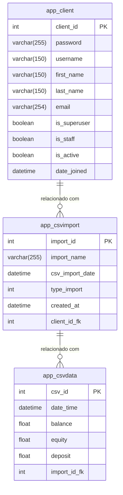

# Import CSV

## Stack Tecnológica

## Front-end
- Linguagem: [Typescript](https://www.typescriptlang.org/)
- Framework: [React.js](https://react.dev/) | [Next.js](https://nextjs.org/)
- Estilo: [TailwindCSS](https://tailwindcss.com/)
- Sistema de Componentes: [Shadcn UI](https://ui.shadcn.com/)
- Gerenciador de Pacotes: [pnpm](https://pnpm.io/pt/)

## Back-end
- Linguagem: [Python](https://www.python.org/)
- Framework: [Django](https://www.djangoproject.com/)
- Gerenciador de Pacotes: [Pipenv](https://pipenv.pypa.io/)
- Banco de Dados: [PostgreSQL](https://www.postgresql.org/)

# Escopo do Projeto

## Página de Login
- **Funções**:
  - Campo de input para Email e Senha
  - Login com Google
  - Esqueci minha senha
  - Criar Usuário

## Sistema
- **Funções**:
  - Importar CSV
  - Menu tipo "Hambúrguer"
  - Exibir as importações realizadas com a soma de uma coluna específica
  - Opção de excluir CSV
  - Gráfico interativo mostrando as importações selecionadas.

- **Especificações**:
  - Eixo X do gráfico: Data da Transação
  - Eixo Y do gráfico: Saldo
  - Sistema desenvolvido para uso de um único usuário.
  - Design responsivo para dispositivos móveis.
  - Sem logos adicionais.
  - O layout será baseado no design fornecido pelo cliente.


# Modelo de Banco de Dados



---


# Processos de inicialização


## Com Docker

1. Defina as variáveis de ambiente em um arquivo `.env` na raiz do repositório, seguindo o exemplo do arquivo [`.env.example`](.env.example).
## Exemplo de .env a ser seguido
```.env
POSTGRES_DB= nome do banco
POSTGRES_USER= usuario do db
POSTGRES_PASSWORD= senha do db
POSTGRES_HOST=127.0.0.1  
POSTGRES_PORT=5432

DJANGO_KEY= sua secret key do django 
DJANGO_SUPERUSER_PASSWORD= Senha de super usuario 
DJANGO_SUPERUSER_EMAIL= Email
DJANGO_SUPERUSER_USERNAME= Nome de usuario 

NEXT_PUBLIC_API_URL=http://127.0.0.1
NEXT_PUBLIC_API_PORT=8000

WEB_URL=http://127.0.0.1
WEB_PORT=3000
```
3. Execute o comando `docker-compose up` para subir o servidor.


## Caso queira subir manualmente
### API

1. Antes de iniciar a API, suba um banco de dados PostgreSQL.
2. Defina as variáveis de ambiente em um arquivo `.env` dentro da pasta `api-server`, seguindo o exemplo do arquivo [`.env.example`](api/.env.example).
3. Execute `pipenv install` para instalar as dependências.
4. Execute `pipenv run migrate` para aplicar as migrações do banco de dados.
5. Execute `pipenv run superuser` para criar um super usuário, com base nas informações do arquivo `.env`.
6. Execute `pipenv run start` para iniciar o servidor.

O servidor estará disponível em [http://localhost:8000](http://localhost:8000).

### Frontend Web

1. Antes de iniciar o frontend, certifique-se de que a API está rodando.
2. Rode o comando `pnpm install` para instalar as dependências.
3. Defina as variáveis de ambiente em um arquivo `.env` dentro da pasta `web`, seguindo o exemplo do arquivo [`.env.example`](web/.env.example).
4. Rode o comando `pnpm run dev` para iniciar o servidor de desenvolvimento.
5. O frontend estará disponível em [http://localhost:3000](http://localhost:3000).

Para ambiente de produção, execute:
- `pnpm run build` para gerar a build de produção
- `pnpm run start` para iniciar o servidor de produção.


# Configuração do Google OAuth no Django Admin

Para configurar a autenticação com Google OAuth no Django Admin:

1. Acesse o [Google Cloud Console](https://console.cloud.google.com/).
2. Crie um novo projeto ou selecione um projeto existente.
3. Ative a **API gmail +** e a **indenty Toolkit API**.
4. Vá em **Credenciais** > **Criar Credenciais** > **ID do Cliente OAuth 2.0**.
5. Configure as URLs de redirecionamento:
   - **Autorização**: `http://localhost:8000/accounts/google/login/callback/` (ou sua URL de produção).
6. Copie o **Client ID** e o **Client Secret**.

Agora no **Django Admin**:

1. Vá para **Sites** e configure o domínio correto (por exemplo: `localhost` ou seu domínio de produção).
2. Vá para **Social applications**:
   - Adicione um novo aplicativo e selecione o **Provider** como Google.
   - Insira o **Client ID** e o **Client Secret**.
   - Associe o site correto ao aplicativo.
3. Salve e teste a autenticação.


