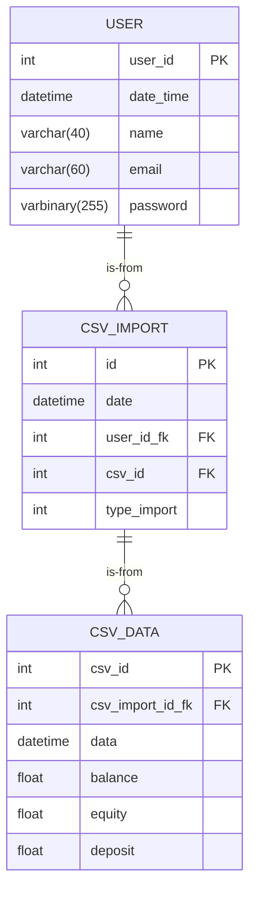

# Project scope

## Login page
  - Functions
    - input field for Email and Password
    - Login and google
    - Forgot password
    - Create User

  - specification
    - Two-factor authentication : Not required 
    - User Permission : Not required 
    - Email Server: Not required.
   
## System
  - Functions
    - Import CSV
    - Burguer menu
    - Viewing the imports performed by displaying a column with the sum of column X
    - Delete CSV option.
    - Interactive graph showing selected imports.

  - Specifications:
    -  X-axis of the graph: Transaction Date.
    -  Y-axis of the graph: Balance.
    - System designed for use by a single user.
    - Responsive design for mobile devices.
    - No logos will be added.
    - Design will follow the layout provided by the client.

# Architecture

## Database model

# Stack

## Front-end
- Language: [Typescript](https://www.typescriptlang.org/)
- Framework: [React.js](https://react.dev/) | [Next.js](https://nextjs.org/)
- Style Lib: [TailwindCSS](https://tailwindcss.com/)
- Component System: [Shadcn UI](https://ui.shadcn.com/)
- Package Manager: [pnpm](https://pnpm.io/pt/) _*Alternative to `npm`_

## Back-end
- Language: [Python](https://www.python.org/)
- Framework: [FastAPI](https://fastapi.tiangolo.com/)
- Package Manager: [Pipenv](https://pipenv.pypa.io/)
- Database: [PostegreSQL](https://www.postgresql.org/)

# Example:

## Login page

## System
  
  
## Graphics
  

## Database 

